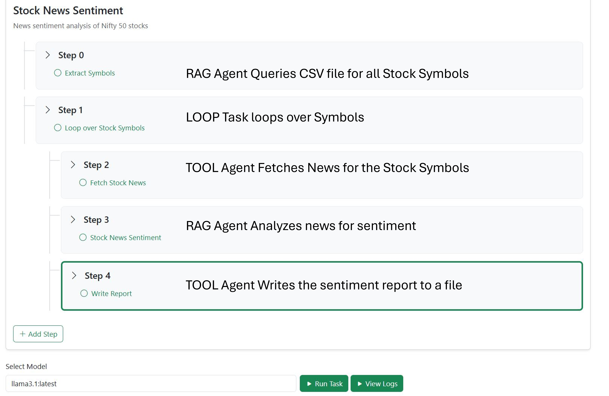

# Agentollama

## 🚀 Overview
The **Agentollama Framework** is a UI-driven framework that enables the creation, execution, and monitoring of intelligent Agents without writing business logic. It leverages AI to dynamically invoke API calls, integrate with legacy applications, and automate complex workflows—all within an intuitive user interface.



## ✨ Features

### 1️⃣ **Dynamic Tool Invocation**
- AI determines which functions to call dynamically, without hardcoding.
- Example: A simple calculator POC that invokes arithmetic tools purely based on AI reasoning.

### 2️⃣ **Automated API Integration**
- Generates code dynamically for API calls using AI.
- Tools are loaded dynamically when an Agent is called to perform a task.
- Can be used to integrate with legacy applications for productivity enhancement.

### 3️⃣ **Execution Logs & Debugging**
- Real-time execution step tracking.
- Displays logs of task execution and decision-making by Agents.
- Helps debug why a particular Agent took a specific action.

### 4️⃣ **Structured Output Enforcement**
- Ensures Agents produce outputs in a predefined format.
- Prevents deviation in reasoning and decision-making.
- Essential for enterprise use cases where multiple API interactions must follow strict formats.

### 5️⃣ **Knowledge Repository & RAG Integration**
- Vectorized file storage for intelligent querying.
- **Retrieval-Augmented Generation (RAG) Agents** to enhance decision-making with external knowledge.
- **Loop Agents** to iterate over datasets and execute workflows dynamically.

### 6️⃣ **Enterprise Workflow Automation**
- Enables seamless multi-agent orchestration for business processes.
- Example: Stock inventory management using AI and APIs—without writing business logic.
- Example: Automated stock market sentiment analysis:
  - Queries a knowledge repository for stock symbols.
  - Fetches news articles for each symbol.
  - Analyzes sentiment via a RAG Agent.
  - Stores insights in a structured output.

## 🔥 Recent Enhancements
- **DeepSeek R1 (8B Model) Integration** for on-device tool code generation.
- **UI-based Agent Execution**—no need to touch an IDE!
- **Performance Metrics & Testing (Upcoming Feature)** to analyze Agent efficiency and decision-making accuracy.

## 📌 Getting Started
### Quick Setup Instructions
#### Prerequisites
- Python 3.x
- Ollama (AI Model Server)
- Django
- Vector Database (for Knowledge Repository)

#### Installation
```sh
# Clone the repository
git clone https://github.com/your-repo/agentollama.git
cd agentollama

# Create and activate virtual environment
python -m venv venv
source venv/bin/activate  # On Windows use `venv\Scripts\activate`

# Install dependencies
pip install django ollama

# Run Ollama server in the background with Llama3.1 8B Model
ollama run llama3.1 8b &

# Run the Django server
python manage.py runserver
```

### Usage
1. Define your Agents through the UI.
2. Load API Tools dynamically (generated by AI).
3. Monitor execution logs in real-time.
4. Automate workflows effortlessly!

## 🎯 Roadmap
- **Dynamic Business Testing & Performance Metrics**
- **Advanced Agent Collaboration** for multi-step AI-driven decision-making
- **Enhanced RAG Capabilities** for deeper contextual understanding

## 🤝 Contributing
Pull requests are welcome! For major changes, please open an issue first to discuss your ideas.

## 📜 License
MIT License. See `LICENSE` for details.

## 💡 Connect
For updates and discussions, follow me on [LinkedIn/Twitter/Blog].

---

✨ AI-driven automation is the future. Let’s build it together! 🚀

